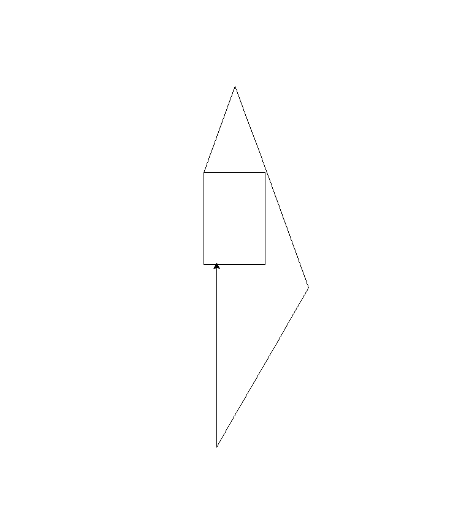

# Turtle Keyboard Controller

This Python project allows you to control a turtle using your keyboard. You can move the turtle forward, backward, and rotate it left or right. You can also clear the screen and reset the turtle's position.

## How It Works

- The program uses Python's `turtle` module.
- A turtle object (`tim`) is created to draw on the screen.
- Keyboard bindings are set up to control the turtle's movements.

## Controls

- `w` - Move the turtle forward by 50 pixels
- `s` - Move the turtle backward by 50 pixels
- `a` - Rotate the turtle left by 10 degrees
- `d` - Rotate the turtle right by 10 degrees
- `c` - Clear the screen and reset the turtle to the center

## Notes

- The turtle moves in increments of 50 pixels or degrees.
- Press `c` anytime to reset the drawing.

